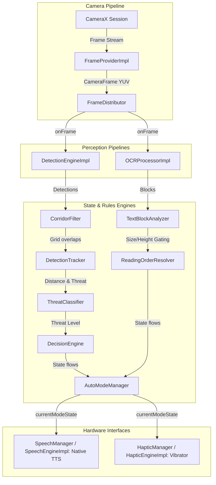

# Drishti

[](https://developer.android.com)
[](https://kotlinlang.org)
[](https://developer.android.com/jetpack/compose)
[](https://developer.android.com/topic/libraries/architecture)
[](https://developer.android.com/training/dependency-injection/hilt-android)
[](https://opensource.org/licenses/MIT)

Drishti (Sanskrit: *Vision* or *Insight*) is a production-quality, on-device assistive vision Android application designed to aid visually impaired users. Built on a shared CameraX frame distribution pipeline, it runs real-time object detection (YOLO TFLite) and text recognition (ML Kit OCR) completely offline to help users navigate their environment safely and read printed text autonomously.

---

## Key Features

- **Real-Time Obstacle Detection**: On-device YOLO TensorFlow Lite inference detects and classifies environment obstacles.
- **Perspective Corridor Filtering**: Focuses object tracking inside a 9-point perspective trapezoid representing the user's forward walking path, reducing false positives.
- **Euclidean Tracker & Threat Scoring**: Assigns unique tracks to objects, monitoring distance and approaching speed to calculate a threat index ($0.0$ to $1.0$).
- **Intelligent Decision Engine**: Prioritizes obstacle threats using class weights and hysteresis locks to select a single target for feedback.
- **Spoken Navigation Guidance**: Converts decisions into directions (*Left*, *Center*, *Right*) and distances (*Far*, *Nearby*, *Very Close*, *Immediate*).
- **Rhythmic Haptic Cues**: Translates threat levels into distinct vibration patterns (`CAUTION`, `WARNING`, `CRITICAL`) with amplitude configuration.
- **Read Mode (ML Kit OCR)**: Uses ML Kit Text Recognition v2 to extract text lines, sorted into a natural reading sequence.
- **Dynamic Auto Mode**: Automatically switches between Walk Mode and Read Mode based on path clearance and stable text presence.
- **Performance & Diagnostics Dashboard**: Symmetrical debug panels displaying processing latencies, frame drops, memory, CPU, and battery.

---

## Tech Stack

| Technology | Category | Purpose |
|------------|----------|---------|
| **Kotlin** | Language | Primary application language |
| **Jetpack Compose** | UI Framework | Fully declarative high-contrast material interfaces |
| **CameraX** | Hardware | Shared camera preview and frame distribution |
| **TensorFlow Lite** | Machine Learning | On-device YOLO object detection inference |
| **Google ML Kit** | Machine Learning | Text Recognition v2 Latin OCR processing |
| **Hilt** | Dependency Injection | Compile-time dependency injection container |
| **Coroutines & StateFlow** | Concurrency | Reactive flow emission and thread offloading |
| **Material 3** | Styling | Symmetrical, high-contrast accessible styling |
| **Android SDK** | Core OS | Platform interfaces, TTS service, Vibrator manager |

---

## System Architecture

Drishti implements a decoupled observer pattern. CameraX frames are distributed via a non-blocking `FrameDistributor` to parallel perception pipelines.



---

## Project Structure

```directory
app/src/main/java/com/drishti/
├── camera/            # CameraX setups, FrameProvider, and FrameDistributor
├── controller/        # SceneAnalyzer, AutoModeManager, and ModeControllerImpl
├── detection/         # YOLO TFLite wrapper, CorridorFilter, and Tracker
├── di/                # Hilt Dependency Injection bindings
├── haptics/           # HapticManager, PatternGenerator, and Vibrator mappings
├── models/            # AppSettings, NavigationDecision, OCRBlock, and telemetry structures
├── ocr/               # OCRProcessorImpl, TextBlockAnalyzer, and ReadingOrderResolver
├── permissions/       # Camera permission manager flow
├── repository/        # SettingsRepository (SharedPreferences) and ControllerRepository
├── speech/            # SpeechManager, SpeechQueue, and TTS Engine
├── ui/                # Compose screens, NavGraphs, and custom ViewModels
│   ├── components/    # CameraPreview, CameraOverlay, and PerformanceOverlay
│   ├── navigation/    # App Destinations config
│   ├── screens/       # Splash, Home, Settings, Permissions, and About
│   └── theme/         # High-contrast accessibility color palettes
└── utils/             # PerformanceMonitor, Logger, and AppError handles
```

---

## Key Capabilities

### Walk Mode
Monitors environment hazards by running a 10 FPS YOLO object detector. Detections are mapped to the user's forward walking path via a coordinate perspective trapezoid. Active threats are tracked across frames and mapped to four severity categories (`SAFE`, `CAUTION`, `WARNING`, `CRITICAL`), generating directional voice alerts and matching haptic vibration pulses.

### Read Mode
Invokes Google ML Kit Latin v2 OCR to extract lines of text from printed media. Lines are organized using a geometric sorting algorithm (primary: top-to-bottom, secondary: left-to-right) to resolve a natural reading order. Spoken guidance reads the text, collapsing duplicate blocks over consecutive frames.

### Auto Mode
Coordinates dynamic perception switches under the hood without manual toggle requirements:
- **Danger Override**: Any `WARNING` or `CRITICAL` hazard instantly overrides reading, stops OCR text speech, and switches back to navigation guidance.
- **Text Stability**: If the path is clear (`SAFE` or `CAUTION`) and stable text has been present in the viewport for $\ge 2.0\text{s}$, the app switches to Read Mode.
- **Text Disappearance**: Returns to Walk Mode if no text blocks are detected for $\ge 1.0\text{s}$.

### Performance Monitoring
Tracks on-device statistics inside a background monitoring daemon. Collects JVM heap size, estimated CPU load, battery level, frame drops, and computes rolling averages over 5-second windows for YOLO and OCR execution speeds.

### Accessibility Gating
Built with screen-reader compatibility, large touch targets ($\ge 80\text{dp}$), high-contrast styling conforming to WCAG standards, and clear content descriptions for all non-text widgets.

---

## Screenshots

| Walk Mode | Read Mode |
|-----------|-----------|
|  | *(Add Screenshot)* |

---

## Performance Diagnostics

- **Dynamic Frame Gates**: YOLO is restricted to $10\text{ FPS}$ and OCR is restricted to $5\text{–}6\text{ FPS}$ to maintain low CPU load and prevent device heating.
- **Direct Media Maps**: ML Kit processes CameraX `ImageProxy` YUV planes directly via native media buffers, preventing GC memory churn or duplicate bitmap copies.
- **Memory Gated Lifecycle**: TFLite interpreters and ML Kit recognizers are allocated dynamically on-demand and fully closed when stopping pipelines, avoiding native heap leaks.

---

## Getting Started

### Prerequisites
- Android Studio Koala+ or IntelliJ IDEA.
- Android SDK version 29 or higher.
- A physical Android device with a camera (recommended for testing on-device hardware engines).

### Clone
```bash
git clone https://github.com/tanish0320/Drishti.git
cd Drishti
```

### Build & Run
1. Open the project in Android Studio.
2. Let Gradle sync and download dependencies.
3. Select a device running Android API 29+ and hit **Run**.

---

## Roadmap

- **v1.0** (Current): Assistive navigation, corridor filters, haptic warnings, ML Kit OCR, and Auto Mode switches.
- **v2.0**:
  - Trajectory estimation and approaching hazard predictions.
  - Accessibility-specific YOLO models (curbs, stairs, trash bins).
  - Integration with wearables, smart glasses, and smart watches.
  - Currency and traffic light color recognitions.

---

## Contributing

Contributions to Drishti are welcome. Please fork the repository, create a feature branch, and submit a pull request. Ensure that your commits include clear descriptions and that your code builds successfully with zero compiler warnings.

---

## License

This project is licensed under the MIT License. See [LICENSE](LICENSE) for details.

---

## Author

**Tanish Suragihalli**
- GitHub: [@tanish0320](https://github.com/tanish0320)
